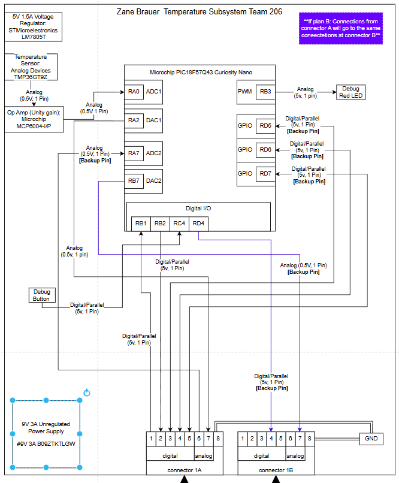

# Overview

This subsystem represents **Zane Brauer's** portion of **Team 206’s Smart Curtain Control** project.  
It focuses on detecting the room temperature using a temperature sensor through the **Microchip PIC18F57Q43 Curiosity Nano** microcontroller. 

---

# System Description

This system has a **Temperature sensor** that provides a analog input to the MCU through ADC pins. The system also has a **Button** for debugging or in otherwords recalibration.
The microcontroller takes the inputs from the **Temperature sensor** which outputs it to the **Analog connector.** The connector leads back to the motor allowing 
the cutrain to open or close. The **red LED Debugger** provides visual feedback on system status for the Debugging proccess. The **Button** input goes into the Microcontroller, specifically the Digital I/O allowing for a recalibration to occur as well as activating the **red LED Debugger.**

---

# Power Configuration

The design uses the voltage level of: **5V, 1.5A regulated supply** for logic and sensors.  

---

# Signal Connections

- **PWM Outputs (RA1, RC2):** Outputs Red LED Indicator and outputs temperature sensor input to analog connector 
- **Digital I/O Ports (RB1, RB2, RC4):** Routed through the 8-pin connector for inter-board communication and expansion. Note: RB1 and RB2 are Ribbion Pins.  
- **Connector Pins:**
  - Pins **1–5:** Digital signals  
  - Pins **6–7:** Analog sensor data  
  - Pin **8:** Ground (GND)

Each connection is clearly labeled with its **direction** and **signal type** to maintain compatibility and simplify system integration.

---

### Zane's Connector (Temperature Sensor Circuit Connector)

| Pin | From        | To          | Type            | Description                              |
|-----|-------------|-------------|-----------------|------------------------------------------|
| 1   | Mihir (RC4) | Zane (RB1)  | 0–5 V Digital   | Digital control / status signal          |
| 2   | Zane (RB2)  | Mihir (RD0) | 0–5 V Digital   | Digital control / status signal          |
| 3   | Mihir (RD5) | Zane (RD5)  | 0–5 V Digital   | Flex pin (general‑purpose digital I/O)   |
| 4   | Mihir (RD6) | Zane (RD6)  | 0–5 V Digital   | Flex pin (general‑purpose digital I/O)   |
| 5   | Mihir (RD7) | Zane (RD7)  | 0–5 V Digital   | Flex pin (general‑purpose digital I/O)   |
| 6   | Mihir (RB7) | Zane (RA7)  | 0–5 V Analog    | Motion sensor output                     |
| 7   | Zane (RA2)  | Mihir (RA2) | 0–5 V Analog    | Temperature sensor output                |
| 8   | Ground      | Ground      | Ground          | Common ground reference                  |

---

## Block Diagram 
Showing an example of how to import a screenshot of the block diagram created outside of git and brought into a page.

