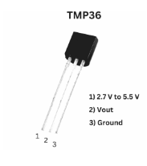
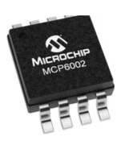
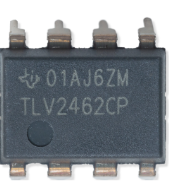

# Component Selection — Team 206: TechMinds

---

## 5 V, 1.5 A Regulator

| Solution | Pros | Cons |
|-----------|------|------|
| **Option 1 — 7805 Linear Regulator (TO-220)** Dropout ≈ 2 V Simple 2-capacitor application Price: ~$1–$2 (qty 1) [Product Page](https://www.digikey.com/en/products/filter/linear-voltage-regulators/699)  | • Very simple and low-noise output • Easy to source and short lead time • Excellent line/load regulation | • Inefficient from 12 V → 5 V • Needs heatsink above ~300 mA • Dropout ≈ 2 V limits low-Vin |
| **Option 2 — 5 V Buck Module (e.g., MP1584 / LM2596)** High-efficiency step-down DC/DC Price: ~$2–$6 [Product Page](https://www.digikey.com/en/products/filter/dc-dc-converters/882)  | • High efficiency → runs cool from 12 V • Handles higher load current • Wide input range and adjustable output | • Switching ripple/noise requires filtering • PCB layout and EMI critical • More components; taller height |
| **Option 3 — MCP1825S-5002 (5 V LDO)** 1 A LDO, lower dropout than 7805 Price: ~$1–$2 [Product Page](https://www.digikey.com/en/products/detail/microchip-technology/MCP1825S-5002E-AB/1505941)  | • Lower dropout than 7805 • Quieter output than buck • Simple BOM | • Still linear → wastes heat • 1 A limit • Thermal design needed above a few hundred mA |

**Choice:** Option 1 — LM7805  
**Rationale:** Has a Low noise output as well as myself personally having familiarity with this product as it was used all semsester in my EGR 304 project class.

---

## Temperature Sensor (Analog Output)

| Solution | Pros | Cons |
|-----------|------|------|
| **Option 1 — LM35 (analog 10 mV/°C)** TO-92 or SOIC Price: ~$1–$3 [TI Product Page](https://www.ti.com/product/LM35)  | • Linear 10 mV/°C scaling • Low current; minimal external parts • Well-documented | • Analog output susceptible to noise • Needs buffering for long leads • Accuracy modest without calibration |
| **Option 2 — TMP36 (analog with offset)** 2.7–5.5 V supply (750 mV @ 25 °C) Price: ~$1–$2 [Analog Devices Page](https://www.analog.com/en/products/tmp36.html)  | • Works from 5 V rail • Low power and easy ADC interface • Wide temp range (−40 to 125 °C) | • Accuracy ±2 °C • Offset must be subtracted in firmware • Analog output needs filtering |
| **Option 3 — MCP9700 (analog)** Slope 10 mV/°C with 500 mV offset Price: < $1 [Microchip Page](https://www.microchip.com/en-us/product/MCP9700)  | • Low cost • Operates at 5 V • Compatible with PIC ADC | • Offset adds math/error • Accuracy ±2 °C typical • Still analog → noise/EMI sensitive |

**Choice:** Option 2 — TM36  
**Rationale:** Works from a 5V rail as well as has a low power and easy ADC interface.

---

## Op-Amp (Buffer / Gain Stage @ 5 V)

| Solution | Pros | Cons |
|-----------|------|------|
| **Option 1 — MCP6002 (dual, rail-to-rail I/O)** 1.8–5.5 V, 1 MHz GBW Price: ~$0.50–$1.50 [Microchip Page](https://www.microchip.com/en-us/product/MCP6002)  | • Rail-to-rail I/O at 5 V • Low quiescent current • Unity-gain stable | • Limited bandwidth (1 MHz) • Modest slew rate • Low output drive |
| **Option 2 — TLV2462 (dual, rail-to-rail I/O)** 2.7–6 V, 6.4 MHz GBW Price: ~$1–$2 [TI Page](https://www.ti.com/product/TLV2462)  | • Higher bandwidth and slew rate • Rail-to-rail I/O on 5 V • Good dynamic range | • Higher quiescent current • More layout-sensitive • Slightly higher cost |
| **Option 3 — LM358 (dual, non-R-R)** 3–32 V classic op-amp Price: ~$0.25–$0.60 [TI Page](https://www.ti.com/product/LM358)  | • Low cost and common • Wide supply range • Available everywhere | • Input/output don’t reach rails • Lower bandwidth and slew • Needs headroom |

**Choice:** Option 1 — MCP6002  
**Rationale:** Matches 5 V rail with rail-to-rail behavior and low power; bandwidth is adequate.

---

## Red LED Indicator (5 V MCU Pin + Resistor)

| Solution | Pros | Cons |
|-----------|------|------|
| **Option 1 — 5 mm Red LED (THT)** Vf ≈ 2.0 V @ 20 mA Price: < $0.10 [Digikey Page](https://www.digikey.com/en/products/filter/led-indication-discrete/105)  | • Bright and easy to see • Breadboard-friendly • Durable leads | • Large footprint • Requires holes (through-hole) • Protrudes above PCB |
| **Option 2 — 0805 SMD Red LED** Vf ≈ 2.0 V typical Price: < $0.10 [Digikey Page](https://www.digikey.com/en/products/filter/led-indication-discrete/105)  | • Compact for tight PCBs • Suited for reflow assembly • Low parasitics | • Tricky to hand-solder • Less visible off-axis • Needs silkscreen polarity |
| **Option 3 — 1206 SMD Red LED** Vf ≈ 2.0 V typical Price: < $0.10 [Mouser Page](https://www.mouser.com/c/optoelectronics/leds/standard-leds-single-color/)  | • Bigger pads (easier hand-solder) • Still compact • Good visibility | • Needs resistor & stencil • Slightly larger area • Taller profile |

**Choice:** Option 2 — 0805 SMD Red LED with 330 Ω resistor  
**Rationale:** Compact, assembly-friendly, and bright enough at ~9 mA.

---

## Button (User Interface Subsystem)

| Solution | Pros | Cons |
|-----------|------|------|
| **Option 1 — PTS645SL43-2 LFS Tactile Switch** Basic push button, low cost, easy to integrate Price: $0.24/each [Product Page](https://www.digikey.com/en/products/detail/c-k/PTS645SL43-2-LFS/1146755) [Datasheet](https://www.ckswitches.com/media/1471/pts645.pdf) .jpeg) | • Very low cost • Easy to use | • Short lifespan • Less tactile feedback |
| **Option 2 — Omron B3F Series Tactile Switch** High-quality tactile push button, reliable, long life Price: $0.24/each [Product Page](https://www.digikey.com/en/products/detail/omron-electronics-inc-emc-div/B3F-1000/33150) [Datasheet](https://omronfs.omron.com/en_US/ecb/products/pdf/en-b3f.pdf) .jpeg) | • Long lifespan (~1M presses) • Reliable actuation • Consistent tactile feel | • Slightly higher cost • Requires careful soldering |
| **Option 3 — Adafruit Mini Tactile Switch** Compact, low profile, low cost Price: $0.75/each [Product Page](https://www.adafruit.com/product/367) [Datasheet](https://cdn-shop.adafruit.com/datasheets/B3F-1000-Omron.pdf) .jpg) | • Compact • Low cost • Easy to use | • Shorter lifespan • Less tactile feel |

**Choice:** Option 2 — Omron B3F Series Tactile Switch  
**Rationale:** The Omron B3F is durable (~1M presses) and provides reliable tactile feedback, making it suitable for frequent user interaction. Cheaper alternatives lack lifespan and consistent feel, which could degrade user experience over time.

---
