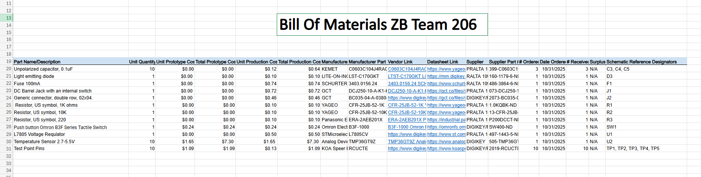

## Overview
The Bill Of Materials is a datasheet of all of the required components that need to go into a PCB. It has the price of each product as well as datasheet links
and the manufacture links.

## Bill of Materials Example (as Image)
{style width: "2000"}
**Figure 1:** Bill of Materials as a screenshot.

