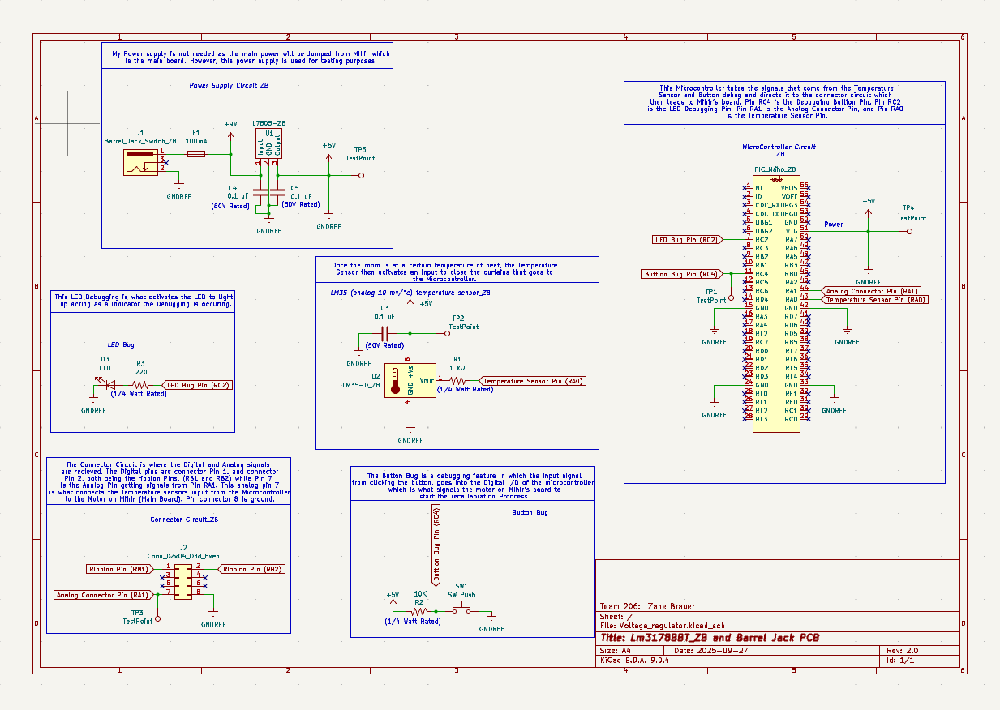

## Overview

This schematic shows the complete design for my Smart Curtain subsystem. It includes the Curiosity Nano microcontroller board, LM7805 power supply, a temperature sensor (with op-amp signal conditioning), and a debug LED. The schematic demonstrates all power, signal, and control connections needed for reliable operation and integration with the team system.

**Figure #1:** Showing a example schematic.

The schematic as a PDF download is available [*here*](Revised_Schem.pdf), and the Zip folder of the project [*here*](Revised.zip).
