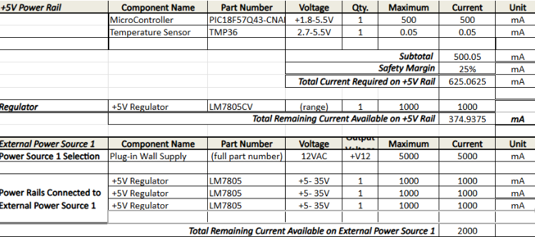

## Overview
This Power Budget is an overview on just how much power should go into my circuit based off of each main conponent
in my circuit.

> Capture your power budge as a image to display. Take time to get clean breaks and a well organized layout.

{style width:"350" height:"300;"}

{style width:"350" height:"300;"}

## Conclusions

From the prepare Power Budget, I now get a better understanding of how much power needs go go into my circuit 
and what exact power supply I need to ensure success on building this improved cirrcuit.

## Resouces

The power budget as a PDF download is available [*here*](PowerBudgetZB.pdf), and a Microsoft Excel Sheet [*here*](PowerBudgetZB2.xlsx).
