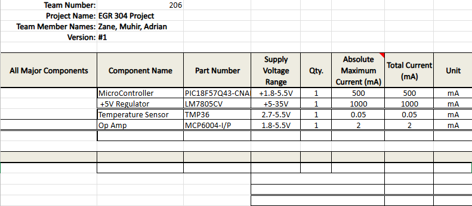
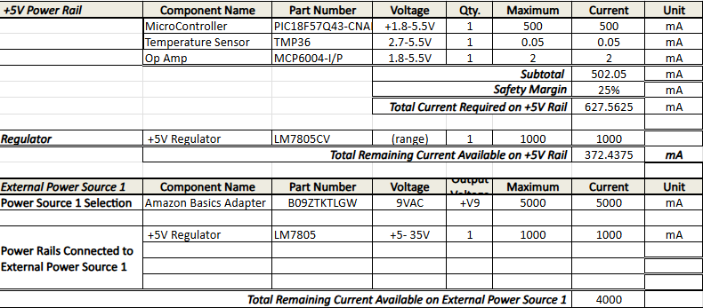

## Overview
This Power Budget is an overview on just how much power should go into my circuit based off of each main conponent
in my circuit.

> Capture your power budge as a image to display. Take time to get clean breaks and a well organized layout.

{style width:"350" height:"300;"}

{style width:"350" height:"300;"}

## Explanation And Conclusion

The power budget also serves to estimate the total current demand of the system. In addition it checks that the 5 V regulator and the external 9 V power supply are capable of safely supporting all connected components. Thus, a Power Budget prepared from this process ensures that the power system is not undersized, which could lead to voltage drops, unstable operation, overheating, or permanent component damage. From the prepare Power Budget, I now get a better understanding of how much power needs go go into my circuit and what exact power supply I need to ensure success on building this improved cirrcuit.

## Resouces

The power budget as a PDF download is available [*here*](206PB.pdf), and a Microsoft Excel Sheet [*here*](PowerBudgetZB1.xlsx).
