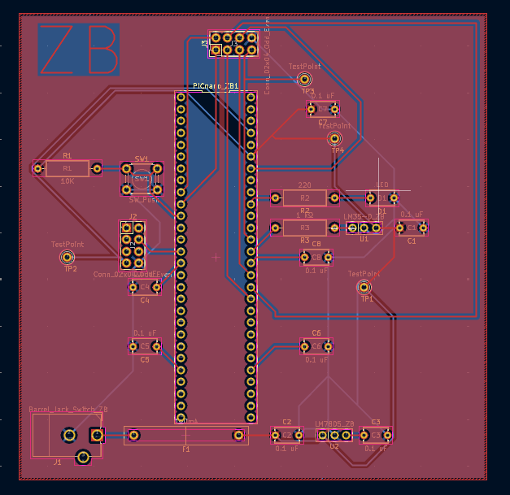

## Overview

This PCB is designed to support a value, PIC Nano Microcontroller and a Temperature Sensor.

## PCB 3D-View

**Figure #1:** Showing Zane's Subsystem PCB Front.

**Figure #2:** Showing Zane's Subsystem PCB Rear.

The schematic as a PDF download is available [*here*](Revised_Schem.pdf), and the Zip folder of the project [*here*](fully_revised.zip).

