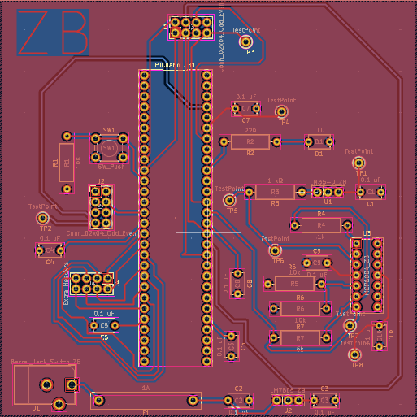

## Overview

This PCB is designed to support a value, PIC Nano Microcontroller and a Temperature Sensor.

## PCB 3D-View

**Figure #1:** Showing Zane's Subsystem PCB Front.

**Figure #2:** Showing Zane's Subsystem PCB Rear.

 The PCB GERBER files can be accessed [*here*](PCB_Brauer_Design.zip). The PCB Project files can be accessed [*here*](Updated_PCB.zip).

